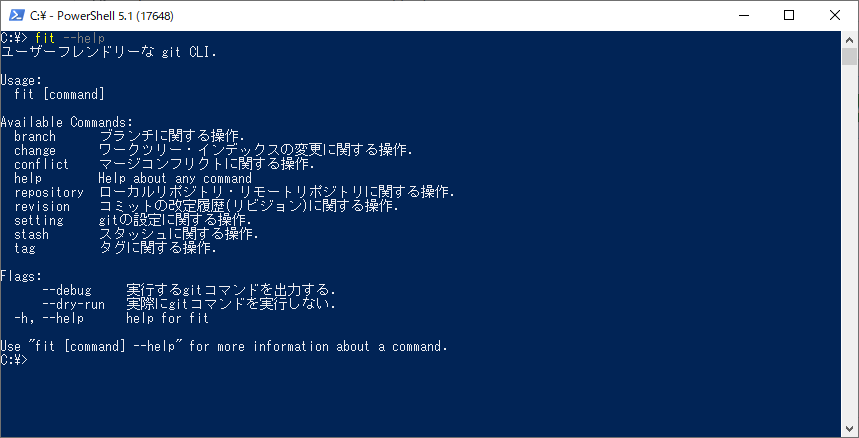

# fit



ユーザーフレンドリーな git CLI

## 概要

> ある初心者がマスター・ギットの下で学んでいた。レッスンの終わりに彼はノートに目を通して言った。  
「師匠、いくつか質問があるんです。聞いてもいいですか？」  
マスター・ギットは頷いた。  
「すべてのタグのリストを見るにはどうしたらいいですか？」  
「git tag」と、マスター・ギットは答えた。  
「すべてのリモートのリストを見るにはどうしたらいいですか？」  
「git remote -v」と、マスター・ギットは答えた。  
「すべてのブランチのリストを見るにはどうしたらいいですか？」  
「git branch -a」と、マスター・ギットは答えた。

途中省略  

>初心者はしばらく考えてから尋ねた。  
「この中のいくつかはもっと一貫性を持たせて、コーディングの最中に思い出しやすくすることができるんじゃないですか？」  
マスター・ギットは指を鳴らした。ホブゴブリンが部屋に入ってきて、初心者を生きたまま食べてしまった。あの世で、初心者は悟りを開いた。  

[Git Koans - The Hobgoblin](https://stevelosh.com/blog/2013/04/git-koans/#s4-the-hobgoblin)

git のコマンドは初心者殺しです。  
fit は git で最もよく使うコマンドのみを厳選し、コマンド体系に一貫性を持たせた git CLI です。

## 必須要件

- git version 2.25.1 以降 [インストール手順](https://git-scm.com/downloads)
- go version 1.20.0 以降 [インストール手順](https://go.dev/doc/install)

## インストール方法

### fit本体のインストール

最新のfitをインストールする。
```
go install github.com/kazurego7/fit/fit@latest
```

### fit コマンド補完機能のインストール
利用するシェルに合わせて、以下のインストール方法から選択してください。

PowerShell:
```powershell
PS> fit setting completion --powershell > fit_completion.ps1
PS> echo '. "fit_completion.ps1"' >> $PROFILE
# この機能を有効にするためには、シェルを再起動する必要があります。
```

Bash: Linux
```bash
fit setting completion --bash > /etc/bash_completion.d/fit_completion
```

Bash: macOS
```bash
fit setting completion --bash > $(brew --prefix)/etc/bash_completion.d/fit_completion
```

Zsh:
```bash
fit setting completion --zsh > "${fpath[1]}/_fit_completion"
# この機能を有効にするためには、シェルを再起動する必要があります。
```

fish:
```bash
fit setting completion --fish > ~/.config/fish/completions/fit_completion.fish
```

### gitステータスバー表示ツールのインストール
利用するシェルに合わせて、以下のインストール方法から選択してください。

PowerShell:  
[posh-git](https://github.com/dahlbyk/posh-git)のインストール方法を以下に記載する
**Powershellを管理者として実行する**
```powershell
Install-Module posh-git -Scope CurrentUser -Force
Add-PoshGitToProfile
# この機能を有効にするためには、シェルを再起動する必要があります。
```

Bash:  
[posh-git-bash](https://github.com/lyze/posh-git-sh)のインストール方法を以下に記載する
```bash
wget https://raw.githubusercontent.com/lyze/posh-git-sh/master/git-prompt.sh ~/.git-prompt.sh
cat << EOF >> ~/.bashrc
source ~/.git-prompt.sh
export PROMPT_COMMAND='__posh_git_ps1 "\\[\[\e[0;32m\]\u@\h \[\e[0;33m\]\w" " \[\e[1;34m\]\n\$\[\e[0m\] ";'$PROMPT_COMMAND
EOF
# この機能を有効にするためには、シェルを再起動する必要があります。
```

## 利用方法

```bash
# ヘルプを表示する
fit --help
```

[ユーザーマニュアル](./doc/manual.md)も併せてご確認ください。

## ライセンス

fit は MIT ライセンスです。
[LICENSE](LICENSE)を確認してください。