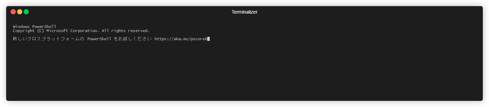

# fit



ユーザーフレンドリーな git CLI

## 概要

> ある初心者がマスター・ギットの下で学んでいた。レッスンの終わりに彼はノートに目を通して言った。  
「師匠、いくつか質問があるんです。聞いてもいいですか？」  
マスター・ギットは頷いた。  
「すべてのタグのリストを見るにはどうしたらいいですか？」  
「git tag」と、マスター・ギットは答えた。  
「すべてのリモートのリストを見るにはどうしたらいいですか？」  
「git remote -v」と、マスター・ギットは答えた。  
「すべてのブランチのリストを見るにはどうしたらいいですか？」  
「git branch -a」と、マスター・ギットは答えた。

途中省略  

>初心者はしばらく考えてから尋ねた。  
「この中のいくつかはもっと一貫性を持たせて、コーディングの最中に思い出しやすくすることができるんじゃないですか？」  
マスター・ギットは指を鳴らした。ホブゴブリンが部屋に入ってきて、初心者を生きたまま食べてしまった。あの世で、初心者は悟りを開いた。  

[Git Koans - The Hobgoblin](https://stevelosh.com/blog/2013/04/git-koans/#s4-the-hobgoblin)

git のコマンドは初心者殺しです。  
fit は git で最もよく使うコマンドのみを厳選し、コマンド体系に一貫性を持たせた git CLI です。

## git is 何？

git とは何か、簡単な紹介と説明が「[git の紹介](./doc/introduction.md)」に記載されています。
git についてまったく知らないという方は、ぜひ読んでみてください。

## インストール方法

「[インストール方法](./doc/install.md)」に記載されています。

## 利用方法

```bash
# ヘルプを表示する
fit --help
```

「[チュートリアル](./doc/tutorial.md)」も併せてご確認ください。

## ライセンス

fit は MIT ライセンスです。
[LICENSE](LICENSE)を確認してください。